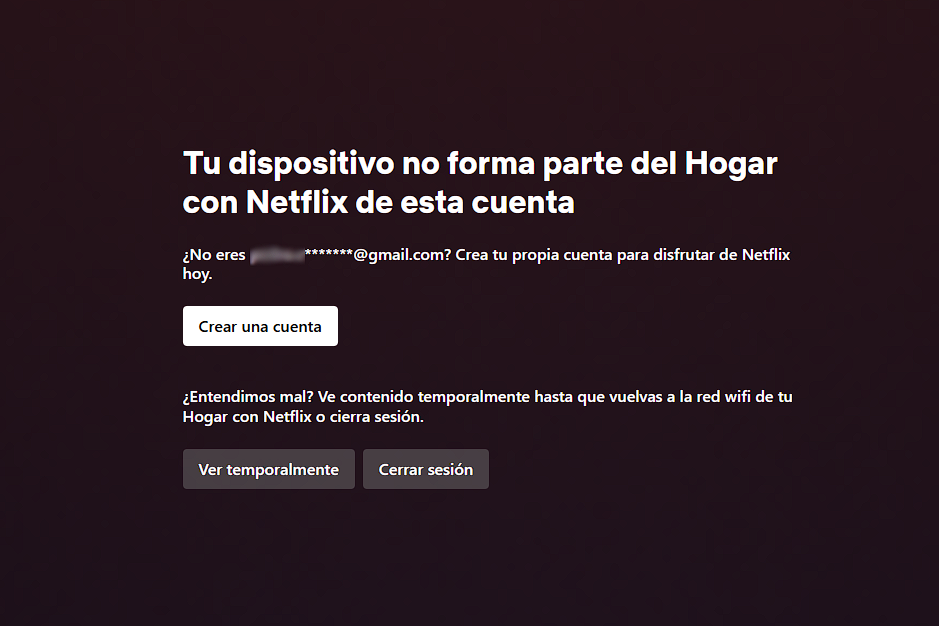

# 🎬 Netflix Cleaner

Extensión para eliminar el molesto modal de "fuera de la red doméstica" en Netflix, reanudar automáticamente el video y reemplazar los controles ocultos con una interfaz personalizada.

---
<details>
<summary>el modal de "fuera de la red doméstica"</summary>

</details>

---

## 🚀 Características

- 🔥 Elimina automáticamente el modal de restricción de red.
- ▶️ Reanuda el video en cuanto sea posible.
- 🎛️ Agrega controles personalizados (play/pause, barra de progreso, fullscreen, botón “volver”).
- 🧠 Reconoce cambios de episodio y reinserta los controles si es necesario.
- ⌨️ Preparado para agregar atajos de teclado como la tecla `F` para fullscreen.
- ⚡️ Compilado con [Bun](https://bun.sh/) + TypeScript.

---

## 🧪 Instalación manual en Brave o Chrome

No necesitas ningún `.crx`. Puedes instalar esta extensión directamente desde su código fuente compilado:

### 🧭 Pasos:

1. Abre una nueva pestaña y ve a:
   - `brave://extensions`  
   - o `chrome://extensions`

2. Activa el **Modo desarrollador** (esquina superior derecha).

3. Haz clic en el botón **“Cargar descomprimida”**.

4. Selecciona la carpeta `package/` que contiene:
   - `manifest.json`
   - `content.js` (compilado)
   - `background.js`  
   *(Estos archivos se generan con el script de build)*

5. ¡Listo! Ahora entra a [Netflix](https://www.netflix.com/) y disfruta sin restricciones.

---

## ⚙️ ¿Cómo compilar `package/` desde el código fuente?

### Requisitos

- Tener [Bun](https://bun.sh/) instalado globalmente
- Clonar este repositorio

### Script para compilar:

```bash
bun run build
```

Esto hace lo siguiente:
- Compila el archivo `src/content.ts` con Bun
- Copia los archivos estáticos desde `public/` hacia `package/`

> La carpeta `package/` es la que se debe cargar en el navegador

---

## 🧠 Créditos

Desarrollado por alguien que se cansó de que Netflix lo trate como extraño en su propia red.  
**Hackeando el DOM con amor y dignidad.**
